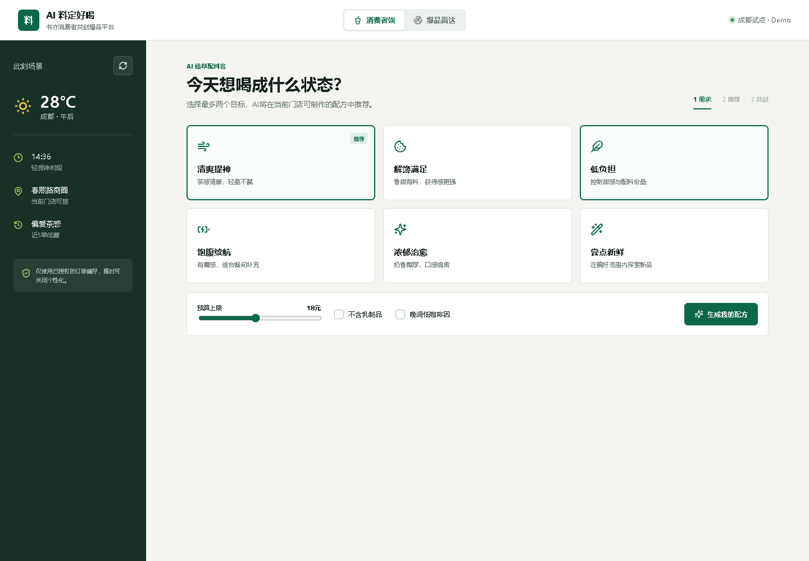

# AI 料定好喝 Demo

书亦烧仙草消费者共创爆品平台的交互式概念验证，由“老辈子”团队制作，用于企业命题开题报告展示。

**在线体验：[https://bowen-ye.github.io/shuyi-ai-demo/](https://bowen-ye.github.io/shuyi-ai-demo/)**



## 核心流程

- 消费者选择清爽、解馋、低负担等饮用目标
- 结合天气、时段、预算和历史偏好生成配方
- 展示茶感、甜感、嚼感、价格、营养参考和推荐理由
- 用户命名并分享配方，形成可追踪的共创配方 ID
- 爆品雷达按复购、好评、采纳、毛利和门店稳定性筛选候选配方
- 支持桌面端和移动端响应式访问

## 本地运行

无需安装依赖，直接打开 `index.html` 即可。为保证剪贴板等浏览器 API 正常工作，也可以启动任意静态文件服务器：

```powershell README.md
npx serve .
```

## 数据声明

Demo 中的配方、评分及经营指标均为方案演示值，不代表书亦烧仙草实际菜单、营养数据或经营数据。营养信息在正式产品中应由品牌基于标准配方和门店操作验证。

## 团队信息

- 团队：老辈子
- 企业：书亦烧仙草
- 赛区：西部赛区 · 成都
- 日期：2026/7/17
