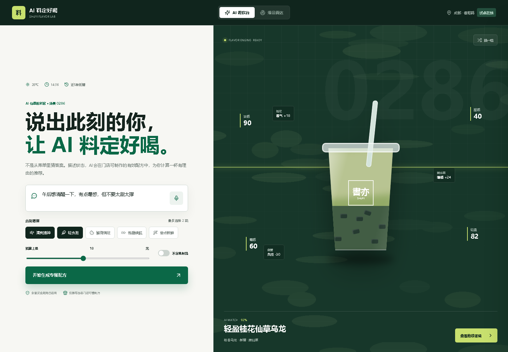

# AI 料定好喝 Demo


书亦烧仙草消费者共创爆品平台的交互式概念验证，由“老辈子”团队制作，用于企业命题开题报告展示。

**在线体验：[https://bowen-ye.github.io/bowen/](https://bowen-ye.github.io/bowen/)**



## 核心流程

- 通过自然语言描述状态，AI 提取场景、口味和负担需求
- 杯体茶层、小料与风味坐标随推荐结果实时变化
- 展示推荐推理、价格、营养参考、出杯效率和爆品潜力
- 用户采纳、命名并分享配方，形成可追踪的共创配方 ID
- 爆品雷达展示趋势、成都口味热区、配方信号和孵化漏斗
- 支持桌面端和移动端响应式访问

## 本地运行

无需安装依赖，直接打开 `index.html` 即可。为保证剪贴板等浏览器 API 正常工作，也可以启动任意静态文件服务器：

```powershell README.md
npx serve .
```

## 数据声明

Demo 中的配方、评分及经营指标均为方案演示值，不代表书亦烧仙草实际菜单、营养数据或经营数据。营养信息在正式产品中应由品牌基于标准配方和门店操作验证。

## 团队信息

- 团队：老辈子
- 企业：书亦烧仙草
- 赛区：西部赛区 · 成都
- 日期：2026/7/17
